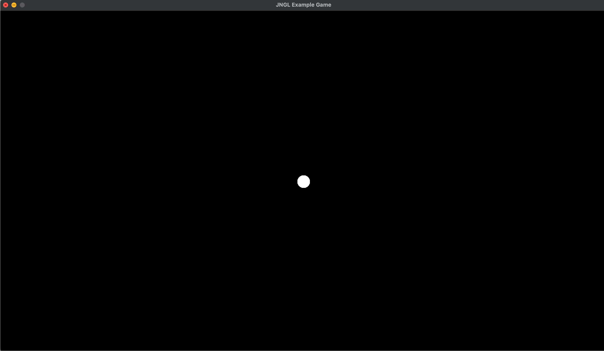

# Pong with JNGL Example Template

A tutorial that teaches how to implement the game Pong in JNGL.

## Let's getting Started

In this tutorial we base on the [JNGL-Starter Project](https://github.com/jhasse/jngl-starter). So first check it out and set up your local machine for building projects with JNGL. In the case you are working on a Windows PC we have a nice short task list in the Readme in the [JNGL-Starter Project](https://github.com/jhasse/jngl-starter). After setting up your first JNGL project you will have a window just showing a black background. In general we need three objects for the Pong game. A ball and two paddles.
<!-- Later we will add a score board. -->

To get anything showing on the screen we can start with the ball. Just a white circle in the middle of the screen.

### The Ball

For the ball we need to create 2 new files. The Ball.hpp and Ball.cpp

In the header `Ball.hpp` we define the Ball class that inherit from GameObject, every GameObject in JNGl need a step and a draw function. Also our GameObject provides a position, a jngl::Vec2 the 2D Vector class in JNGL that has a x and y position.

```cpp
#pragma once

#include "GameObject.hpp"

#include <jngl.hpp>

class Ball : public GameObject {
public:
    Ball(jngl::Vec2 position);
    bool step() override;
    void draw() const override;

private:
};
```

In the `Ball.cpp` we implement our ball class. The first version of our ball does not move jet, so we just return true in step (Hint: If a GameObject returns false it will be deleted). In draw we draw a white circle of the size 20.

```cpp
#include "Ball.hpp"

Ball::Ball(const jngl::Vec2 position){
    this->position = position;
}


bool Ball::step() {
    // Ball logic goes here
    return true;
}

void Ball::draw() const {
	jngl::drawCircle(jngl::modelview().translate(position).scale(BALL_RADIUS),
	                 jngl::Rgba(1, 1, 1, 1));
}
```

To get the ball into the game, we have to create a new ball instance in Game.cpp and emplace_back it into the list (`std::vector`) of game objects.

```cpp
Game::Game() {
    jngl::setBackgroundColor(jngl::Rgb(0, 0, 0));

    gameObjects.emplace_back(std::make_shared<Ball>(jngl::Vec2(0, 0)));
}
```

Now our game will look like that. With the <kbd>esc</kbd> key we can exit the game.



Let's now move the ball. Therefore we need to change the balls position in the step function. As a first test we can update the balls position in the step function. Let's add a new line in the step function that updates the position every frame.

```cpp
bool Ball::step() {
    // Ball logic goes here
    position = position + jngl::Vec2(1, 0);
    return true;
}
```

Now the ball moves slow to the right and also leaves the window. Our next step will be to let the ball bounce back at the window border. Therefor we need store the velocity in a separate variable and also we need to know the window size. In `Ball.hpp` we need to add a `private jngl::Vec2` variable called velocity with a default value of (1, 0). With [jngl::getWindowWidth()](https://bixense.com/jngl/namespacejngl.html#adca649a9f4530deb1d23d36c8be0ce51) and [jngl::getWindowHeight()](https://bixense.com/jngl/namespacejngl.html#a0bd114aaf7ebebf760dcd2b6d1be16d7) we can get the window borders.

We now can make the ball bounce at the window borders:
Ball.hpp

```cpp
private:
    jngl::Vec2 velocity = jngl::Vec2(1,0);
};
```

Ball.cpp's `step()`

```cpp
bool Ball::step() {
    // Ball logic goes here
    position = position + velocity;
    jngl::debugLn(position);

    int width = jngl::getScreenWidth();
    if (position.x > width / 2 || position.x < -width / 2)
    {
        velocity.x = velocity.x * -1.0;
    }

    return true;
}
```

Now you know the basics of creating objects in JNGl. Maybe it's a good point to try creating the Paddle class yourself and after that look into the next steps.

Paddle.hpp

```cpp
#pragma once

#include "GameObject.hpp"

#include <jngl.hpp>

class Paddle : public GameObject {
public:
    Paddle(jngl::Vec2 position, int playerNr);
    bool step() override;
    void draw() const override;
};
```

Paddle.cpp

```cpp
#include "Paddle.hpp"

constexpr int PADDLE_W = 50;
constexpr int PADDLE_H = 200;

Paddle::Paddle(const jngl::Vec2 position) {
    this->position = position;
}


bool Paddle::step() {
    // Paddle logic goes here

    return true;
}

void Paddle::draw() const {
	jngl::Mat3 modelview = jngl::modelview().translate(position);
	// Normal drawRect position is top left corner
	// We want to draw from the rect middle
	modelview.translate(-jngl::Vec2(PADDLE_W / 2, PADDLE_H / 2));
	jngl::drawRect(modelview, jngl::Vec2(PADDLE_W, PADDLE_H), jngl::Rgba(1, 1, 1, 1));
}
```

And in `game.cpp` we need to add the Paddle.

```cpp
Game::Game() {
    jngl::setBackgroundColor(jngl::Rgb(0, 0, 0));

    gameObjects.emplace_back(std::make_shared<Ball>(jngl::Vec2(0, 0)));
    gameObjects.emplace_back(std::make_shared<Paddle>(jngl::Vec2(0, 0)));
}
```

Now we have a Paddle with the top left corner in the middle of the screen, but Pong is a two player game so we need two Paddles. A easy solution it to add a playerNr to the Paddle class and initialise it with 0 and 1.

Paddle.hpp

```cpp
#pragma once

#include "GameObject.hpp"

#include <jngl.hpp>

class Paddle : public GameObject {
public:
    Paddle(jngl::Vec2 position, int playerNr);
    bool step() override;
    void draw() const override;

private:
    const int playerNr;
};
```

Paddle.cpp Constructor

```cpp
Paddle::Paddle(const jngl::Vec2 position, int playerNr) : playerNr(playerNr) {
    this->position = position;
}
```

And Paddle.cpp draw so we draw the paddle from the center and not from the top left corner

```cpp
void Paddle::draw() const {
	jngl::Mat3 modelview = jngl::modelview().translate(position);
	// Normal drawRect position is top left corner
	// We want to draw from the rect middle
	modelview.translate(-jngl::Vec2(PADDLE_W / 2, PADDLE_H / 2));
	jngl::drawRect(modelview, jngl::Vec2(PADDLE_W, PADDLE_H), jngl::Rgba(1, 1, 1, 1));
}
```

In `Game.cpp` we can now add the two Paddles nicely posisioned left and right

```cpp
Game::Game() {
    jngl::setBackgroundColor(jngl::Rgb(0, 0, 0));

    gameObjects.emplace_back(std::make_shared<Ball>(jngl::Vec2(0, 0)));
    int width = jngl::getScreenWidth() / 2;
    gameObjects.emplace_back(std::make_shared<Paddle>(jngl::Vec2(-width + 100, 0), 0));
    gameObjects.emplace_back(std::make_shared<Paddle>(jngl::Vec2(width - 100, 0), 1));
}
```

Now we want to control the Paddles with the keyboard and gamepad. The two example Controls we have defined in the Control.hpp and Control.cpp are examples for a jump and run game so the input only handles left and right movement. For the paddles we need the up and down movement. So we have to patch them.

Control.cpp

```cpp
#include "Control.hpp"

#include <algorithm>

void Control::vibrate() {}

jngl::Vec2 KetchupControl::getMovement() const {
    jngl::Vec2 mov;
    if (jngl::keyDown('w') || jngl::keyDown('W')) {
        mov += jngl::Vec2(0, -1);
    }
    if (jngl::keyDown('s') || jngl::keyDown('S')) {
        mov += jngl::Vec2(0, 1);
    }

    auto controller = jngl::getConnectedControllers();
    if (controller.size() > 0)
    {
        auto y = controller[0]->state(jngl::controller::LeftStickY);
        mov.y += y;
        mov.y = fmaxf(mov.y, -1);
        mov.y = fminf(mov.y, 1);
    }

    return mov;
}

jngl::Vec2 MajoControl::getMovement() const {
    jngl::Vec2 mov;
    if (jngl::keyDown(jngl::key::Up)) {
        mov += jngl::Vec2(0, -1);
    }
    if (jngl::keyDown(jngl::key::Down)) {
        mov += jngl::Vec2(0, 1);
    }

    auto controller = jngl::getConnectedControllers();
    if (!controller.empty()) {
        auto y = controller[0]->state(jngl::controller::RightStickY);
        mov.y += y;
        mov.y = fmaxf(mov.y, -1);
        mov.y = fminf(mov.y, 1);
    }

    return mov;
}
```

Then we can add the Controls to the Paddles. In `Paddle.hpp` we add a new member and a new parameter to the constructor.

Paddle.hpp

```cpp
#pragma once

#include "GameObject.hpp"
#include "Control.hpp"

#include <jngl.hpp>

class Paddle : public GameObject {
public:
    Paddle(jngl::Vec2 position, int playerNr, std::unique_ptr<Control> control);
    bool step() override;
    void draw() const override;

private:
    const int playerNr;
    std::unique_ptr<Control> control;
};
```

Paddle.cpp

```cpp
#include "Paddle.hpp"

#define PADDLE_W 50
#define PADDLE_H 200

Paddle::Paddle(const jngl::Vec2 position, int playerNr, std::unique_ptr<Control> control) : playerNr(playerNr), control(std::move(control)) {
    this->position = position;
}

bool Paddle::step() {
    // Paddle logic goes here
    position += control->getMovement();
    return true;
}

void Paddle::draw() const {
	jngl::Mat3 modelview = jngl::modelview().translate(position);
	// Normal drawRect position is top left corner
	// We want to draw from the rect middle
	modelview.translate(-jngl::Vec2(PADDLE_W / 2, PADDLE_H / 2));
	jngl::drawRect(modelview, jngl::Vec2(PADDLE_W, PADDLE_H), jngl::Rgba(1, 1, 1, 1));
}
```

Now our Paddles can move up and down. But we can also move them out of the screen. That's not what we want. So let's limit the Position. It's very easy and we already have code for that in the controls, so that the controls input can not be larger than 1. Now we want that position.y is not larger than screen height/2 and not smaller negativ screen height/2.

In Paddle.cpp

```cpp
bool Paddle::step() {
    // Paddle logic goes here
    position += control->getMovement();

    int height = jngl::getScreenHeight() / 2;
    position.y = fmaxf(position.y, -height);
    position.y = fminf(position.y, height);
    return true;
}
```

Next we can spend more love to the ball, again. It would be nice, if the ball flies all over the screen and not only from left to right and back.

In Ball.hpp we can change the initial velocity.

Ball.hpp

```cpp
    jngl::Vec2 velocity = jngl::Vec2(4,5);
```

But now we will never see our ball again after the ball leaves the screen at the bottom.
In Ball.cpp we have to also update the collision test for the top and bottom.
I't very easy and you can try it your self if you want. We already have the test for X ;)

Ball.cpp

```cpp
bool Ball::step() {
    // Ball logic goes here
    position = position + velocity;

    int width = jngl::getScreenWidth();
    if (position.x > width / 2 || position.x < -width / 2)
    {
        velocity.x = velocity.x * -1.0;
    }

    int height = jngl::getScreenHeight();
    if (position.y > height / 2 || position.y < -height / 2)
    {
        velocity.y = velocity.y * -1.0;
    }

    return true;
}
```

If you look close you can see, that the ball does not bounce at the border. Instead the ball flies out of the screen and bounces at its center. We can fix that by adding the radius of the ball to the collision check. But we don't want to have magic numbers all over our code, so we can move the 20 to a constant values in the constants.hpp file. (In this step we also move the paddle_w and h into this file.)

constants.hpp

```cpp
#pragma once

#include <string>

const std::string programDisplayName = "JNGL Example Game";

constexpr int BALL_RADIUS = 20;

constexpr int PADDLE_W = 50;
constexpr int PADDLE_H = 200;

void printCentered(const std::string& text, double x, double y);
```

Paddle.cpp's header should now look like this.

```cpp
#include "Paddle.hpp"
#include "constants.hpp"

Paddle::Paddle………
```

We now have everything set up for the collision checks on the paddles. Because we make collision checks with the wall in our Ball object I would also check for collisions with the paddles from inside the ball. Therefore the ball has to know the paddles. In Game.cpp where we create the ball and the paddles we will store the created paddles in a variable so we can add them to the gameObjects and the ball.

Game.cpp

```cpp
Game::Game() {
    jngl::setBackgroundColor(jngl::Rgb(0, 0, 0));

    int width = jngl::getScreenWidth() / 2;

    auto paddlel = std::make_shared<Paddle>(jngl::Vec2(-width + 100, 0), 0, std::make_unique<KetchupControl>());
    gameObjects.emplace_back(paddlel);
    auto paddler = std::make_shared<Paddle>(jngl::Vec2(width - 100, 0), 1, std::make_unique<MajoControl>());
    gameObjects.emplace_back(paddler);

    gameObjects.emplace_back(std::make_shared<Ball>(jngl::Vec2(0, 0), paddlel, paddler));
}
```

For the ball to store the Paddles we have to add 2 private variables and change the constructor.

Ball.hpp

```cpp
#pragma once

#include "GameObject.hpp"

#include <jngl.hpp>

class Paddle;

class Ball : public GameObject {
public:
    Ball(jngl::Vec2 position, std::shared_ptr<Paddle> left, std::shared_ptr<Paddle> right);
    bool step() override;
    void draw() const override;

private:
    jngl::Vec2 velocity = jngl::Vec2(4,5);
    std::shared_ptr<Paddle> left;
    std::shared_ptr<Paddle> right;
};
```

And now to the magic. We can check for the collisions in the bass step method.

Ball.cpp

```cpp
#include "Ball.hpp"
#include "constants.hpp"
#include "Paddle.hpp"

Ball::Ball(const jngl::Vec2 position, std::shared_ptr<Paddle> left, std::shared_ptr<Paddle> right) : left(left), right(right){
    this->position = position;
}

bool Ball::step() {
    // Ball logic goes here
    position = position + velocity;

    int width = jngl::getScreenWidth() / 2;
    if (position.x + BALL_RADIUS > width || position.x - BALL_RADIUS < -width)
    {
        velocity.x = velocity.x * -1.0;
    }

    int height = jngl::getScreenHeight() / 2;
    if (position.y + BALL_RADIUS > height || position.y - BALL_RADIUS < -height)
    {
        velocity.y = velocity.y * -1.0;
    }

    // left paddle
    if (position.x - BALL_RADIUS < left->getPosition().x + PADDLE_W / 2
        && position.y + BALL_RADIUS > left->getPosition().y - PADDLE_H / 2
        && position.y - BALL_RADIUS < left->getPosition().y + PADDLE_H / 2
    )
    {
        velocity.x = velocity.x * -1.0;
    }

    // right paddle
    if (position.x + BALL_RADIUS > right->getPosition().x - PADDLE_W / 2
        && position.y + BALL_RADIUS > right->getPosition().y - PADDLE_H / 2
        && position.y - BALL_RADIUS < right->getPosition().y + PADDLE_H / 2
    )
    {
        velocity.x = velocity.x * -1.0;
    }

    return true;
}

void Ball::draw() const {
	jngl::drawCircle(jngl::modelview().translate(position).scale(BALL_RADIUS),
	                 jngl::Rgba(1, 1, 1, 1));
}
```
